# CS336 中文深度笔记：从 Python 到能训练、优化与评测 LLM

> 基于 Stanford CS336 *Language Modeling from Scratch* 2026 官方讲义与作业；用 2025 官方公开视频补充讲解，并参考多份公开作业的实验记录。资料核对日期：2026-08-11。

这不是 17 次课的逐字翻译，而是一套按依赖关系重排的中文教程。目标读者只需要会 Python、知道神经网络靠反向传播训练；数学、PyTorch、GPU、分布式训练、数据工程和强化学习中缺失的部分会边用边补。

“看完”不会自动让人成为高手。真正的完成标准是：能在不抄答案的前提下做完五个实验项目、解释每个设计的资源代价、定位训练失败原因，并能读论文后判断其改进发生在模型、数据、目标还是系统层。正文、实验和论文地图三条线合在一起，才是这套笔记所说的“LLM 高手”。

## 一张总图

```mermaid
flowchart LR
    A["原始网页/代码/书籍"] --> B["清洗、过滤、去重、混合"]
    B --> C["Unicode 与 BPE tokenizer"]
    C --> D["token IDs 与批数据"]
    D --> E["Decoder-only Transformer"]
    E --> F["交叉熵 + AdamW + 训练循环"]
    F --> G["GPU kernel / FlashAttention"]
    G --> H["DDP/FSDP/张量与流水线并行"]
    H --> I["Scaling law 决定 N、D、C"]
    I --> J["评测、污染检查与诊断"]
    J --> K["SFT / DPO / RLHF / GRPO"]
    K --> L["推理服务、KV cache、量化、批处理"]
    L --> M["文本-图像多模态与 Agent"]
```

贯穿所有章节的统一问题是：在数据、计算、显存、通信和时间预算固定时，怎样得到能力最强且可验证的模型？

## 推荐阅读顺序

1. [00 学习路线与使用方法](chapters/00-roadmap.md)
2. [01 概率、张量与 PyTorch 生存包](chapters/01-foundations.md)
3. [02 语言建模与 Tokenization](chapters/02-tokenization.md)
4. [03 Transformer：从张量形状到完整模型](chapters/03-transformer.md)
5. [04 优化、训练循环与实验科学](chapters/04-training.md)
6. [05 资源核算、GPU、Triton 与 FlashAttention](chapters/05-systems.md)
7. [06 分布式训练](chapters/06-distributed.md)
8. [07 Scaling Laws 与超参数迁移](chapters/07-scaling.md)
9. [08 推理与服务](chapters/08-inference.md)
10. [09 评测：从 loss 到可信结论](chapters/09-evaluation.md)
11. [10 数据工程：Common Crawl 到训练语料](chapters/10-data.md)
12. [11 后训练：SFT、偏好学习与 RLHF](chapters/11-posttraining.md)
13. [12 推理强化学习：从 REINFORCE 到 GRPO](chapters/12-reasoning-rl.md)
14. [13 多模态模型](chapters/13-multimodal.md)
15. [五个综合实验](labs/README.md)
16. [论文地图](appendices/paper-map.md)
17. [公式、形状与资源速查](appendices/cheatsheet.md)
18. [来源、版本与公开作业评估](SOURCES.md)

## 每章怎样读

每章都回答六件事：

- **它解决什么问题**：不先讲术语，先说为什么需要它。
- **机制是什么**：给出张量形状、公式和逐步直觉。
- **资源代价是什么**：参数、FLOPs、激活、显存、I/O 或通信。
- **怎样实现和验证**：给最小伪代码、单元测试和不变量，不提供可直接提交的课程答案。
- **哪里容易错**：列出能“运行但学不对”的静默错误。
- **论文怎样推进了它**：核心论文按问题、洞见、方法、结论和局限解释。

看到公式时，按“对象是什么 → 形状是什么 → 每个下标代表什么 → 为什么这样归一化 → 极端情况是否合理”五步读。看到性能数字时，先问硬件、dtype、batch、序列长度、预热、同步和比较基线是否相同。

## 官方课程映射

| 官方讲次 | 主题 | 本笔记 |
|---|---|---|
| 1 | 概览、tokenization | 00、02 |
| 2 | PyTorch、FLOPs/显存/算术强度 | 01、05 |
| 3 | 架构与超参数 | 03、04 |
| 4 | Attention 替代、MoE | 03 |
| 5-6 | GPU、kernel、Triton | 05 |
| 7-8 | 并行训练 | 06 |
| 9、11 | Scaling laws | 07 |
| 10 | 推理 | 08 |
| 12 | 评测 | 09 |
| 13-14 | 数据来源、过滤、去重、混合 | 10 |
| 15 | SFT/RLHF | 11 |
| 16 | RLVR | 12 |
| 17 | 多模态 | 13 |

## 能力毕业标准

完成后，你应能独立回答并演示：

- 为什么 byte-level BPE 可覆盖任意 Unicode 文本，special token 为什么必须在普通 BPE 之前处理。
- 从 `[B,T]` token IDs 推导 Transformer 每个中间张量的形状和主要 FLOPs。
- 为什么 attention 除以 `sqrt(d_head)`，RoPE 为什么把相对位置信息带进点积。
- 为什么 FlashAttention 是精确 attention，却能把中间显存从平方降到线性。
- DDP、ZeRO/FSDP、张量并行、流水线并行分别切什么，通信量和气泡来自哪里。
- 如何用 IsoFLOP 曲线拟合计算最优的参数量和 token 数，并说明外推为何可能失效。
- 为什么 decode 常受显存带宽限制，GQA、KV cache、量化和连续批处理各优化什么。
- 如何发现 benchmark 污染、prompt 敏感性和 judge 偏差。
- 如何把 Common Crawl 变成有来源记录、可审计、去重且经过消融验证的语料。
- SFT、DPO、PPO、GRPO 的数据、目标和 on/off-policy 属性分别是什么。
- 为什么 reward 上升不等于能力上升，以及怎样监控 KL、熵、长度和 pass@k。

## 学术诚信

CS336 官方明确要求在校生自己完成作业。这里分析公开实现，是为了提炼实验方法、性能测量方式和常见失败模式，不复制完整实现，也不按测试函数逐题给答案。如果你正在修读这门课，应以当期课程政策为准，并把本笔记当作概念教材而非提交模板。
